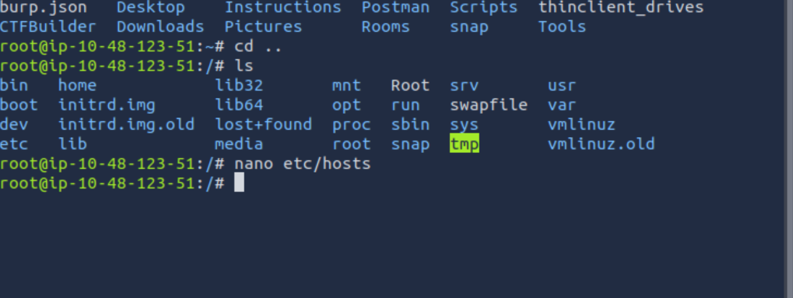
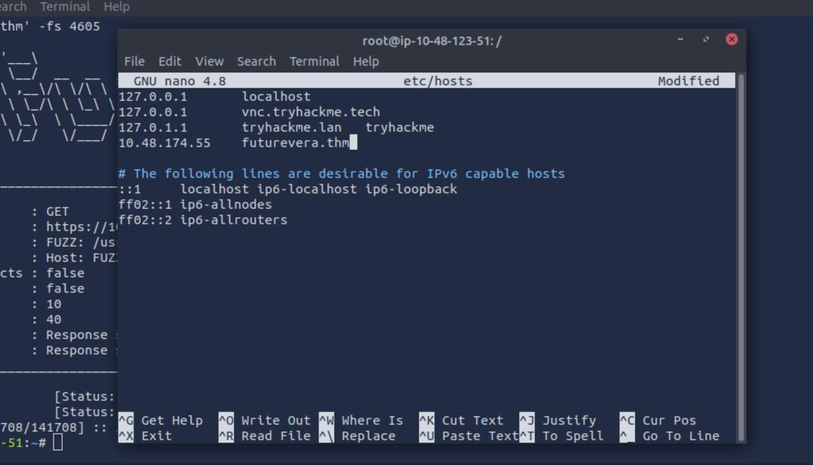
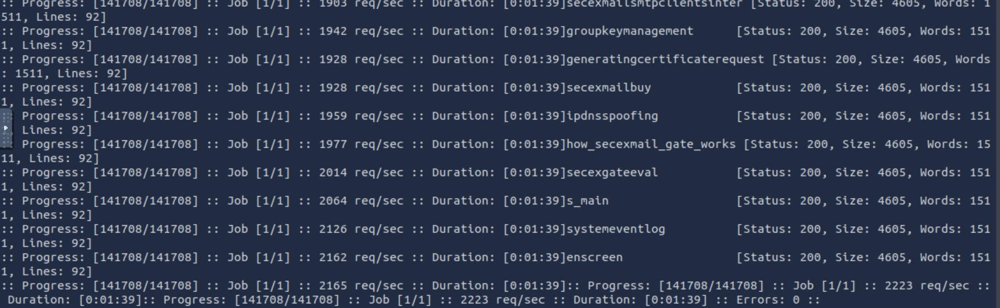
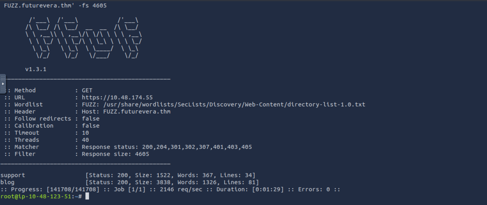
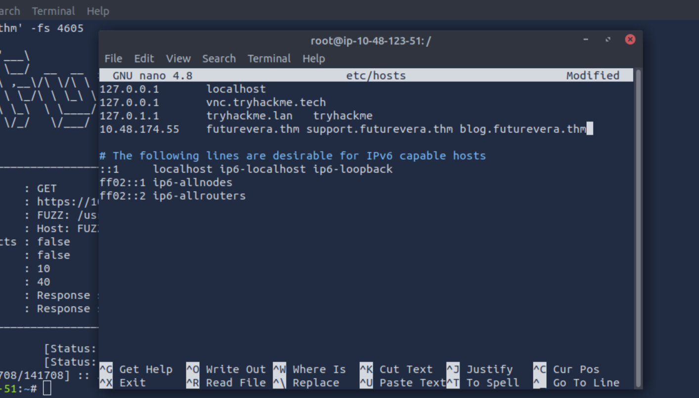
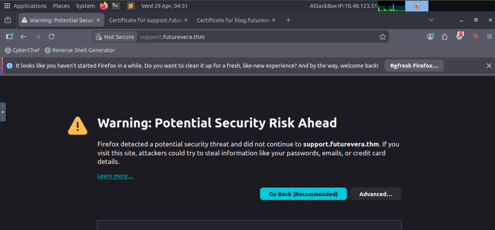
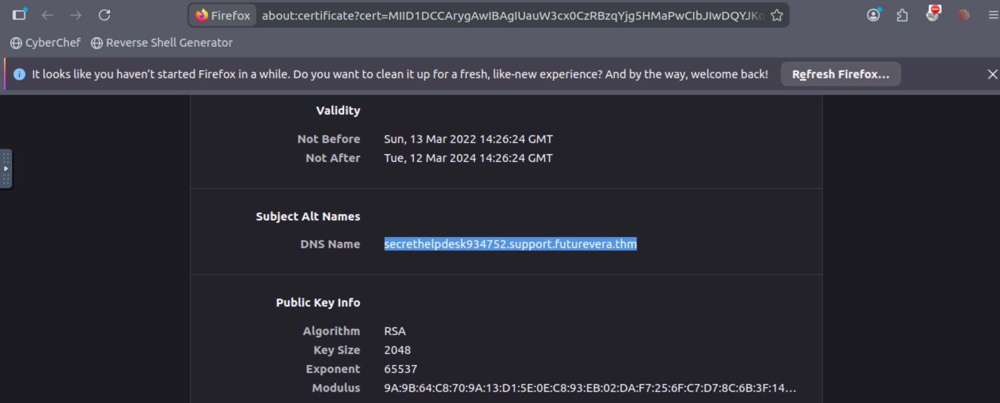

# TryHackMe - Takeover

> **Platform:** TryHackMe  
> **Room:** Takeover  
> **Topics:** Subdomain Enumeration, VHost Fuzzing, SSL Certificate Inspection

---

## Overview

This room focuses on subdomain takeover - a vulnerability where an attacker can claim control over a forgotten or misconfigured subdomain. The path to the flag involves DNS manipulation, virtual host fuzzing, and reading SSL certificate metadata.

---

## Step 1 - Modify `/etc/hosts`

The first thing to do is add the target domain to your local `/etc/hosts` file:

```
<target-ip>  futurevera.thm
```



### Why do I need to modify `/etc/hosts`?

When a domain name is entered in the browser, the system normally queries a public DNS server to resolve it to an IP address. However, `futurevera.thm` is a fake/lab domain - it doesn't exist in any public DNS registry, so no DNS server in the world can resolve it.

The `/etc/hosts` file is the machine's **local DNS override**. Entries here are checked *before* any external DNS query is made.

This is essential for any CTF or lab environment that uses custom `.thm` domains.

---

## Step 2 - Subdomain Enumeration with `ffuf` (VHost Fuzzing)

With the base domain resolving correctly, the next step is to discover hidden subdomains using **Virtual Host (VHost) Fuzzing**.

### What is VHost Fuzzing?

Web servers can host multiple websites on the same IP address by reading the `Host` HTTP header to decide which site to serve. VHost fuzzing exploits this by rapidly sending requests with different values in the `Host` header, watching for responses that differ from the default - which indicates a real subdomain exists.

### Initial Command

```bash
ffuf -u https://<ip> -w /usr/share/wordlists/SecLists/Discovery/Web-Content/directory-list-1.0.txt -H 'Host: FUZZ.futurevera.thm'
```

Running this without any filter floods the results with every invalid subdomain that returns a response (usually a generic "Not Found" or default page), making it impossible to spot real hits.



### Using -fs flag

The `-fs` flag stands for **filter size** - it tells `ffuf` to **hide any response whose body size equals the number you provide**.

1. For every *invalid* subdomain (e.g. `notreal.futurevera.thm`), the server returns the same generic default page. That page has a consistent, predictable size - in this case, **4605 bytes**.
2. By adding `-fs 4605`, it is equivalent to: *"Ignore all responses that are 4605 bytes - those are just the default 'nothing here' page."*
3. The two **real** subdomains (`support` and `blog`) are configured on the server and return *different* pages with *different* sizes - so they are **not** filtered out and appear in the results.

Without filtering, real subdomains are buried in thousands of false positives.

### Filtered Command

```bash
ffuf -u https://<ip> -w /usr/share/wordlists/SecLists/Discovery/Web-Content/directory-list-1.0.txt -H 'Host: FUZZ.futurevera.thm' -fs 4605
```



**Discovered subdomains:**
- `support.futurevera.thm`
- `blog.futurevera.thm`

---

## Step 3 - Add New Subdomains to `/etc/hosts`

Add both discovered subdomains to `/etc/hosts` so your browser can reach them:

```
<target-ip>  futurevera.thm support.futurevera.thm blog.futurevera.thm
```


---

## Step 4 - Inspect the SSL Certificate

Navigate to:

```
https://support.futurevera.thm
```

When the page loads (you may get a certificate warning - proceed anyway):

1. Select **Advanced → View Certificate**
3. Look for the **Subject Alternative Names (SANs)** section



### What to look for

SSL certificates often list multiple domains they are valid for in the SAN field. Here, you'll find an **alternate DNS name** - a secret subdomain that wasn't in the wordlist and wouldn't have been found by fuzzing alone.

Add this new subdomain to `/etc/hosts` as well.



---

## Step 5 - Access the Secret Subdomain

Navigate to the secret subdomain you found in the certificate:

```
https://secret[...].futurevera.thm
```
It returns the same webpage as https://www.futurevera.thm

## Step 6 - Access the Secret Subdomain using HTTP only

Rather than a normal webpage, the browser throws an **error page**. The flag is embedded directly inside the error message itself. This is subdomain takeover: the subdomain exists in DNS/certificates but has no properly configured backend, and the resulting broken response leaks the flag.

---
That's all!

## Key Takeaways

| Concept | Why It Matters |
|---|---|
| `/etc/hosts` modification | Resolve lab/CTF domains that don't exist in public DNS |
| VHost fuzzing with `ffuf` | Discovers subdomains hosted on the same IP with no public DNS records |
| `-fs` filter in `ffuf` | Removes noise from default server responses to surface real hits |
| SSL Certificate SANs | Can expose hidden subdomains that fuzzing would never find |

---

## Tools Used

- `ffuf` - Fast web fuzzer
- SecLists - `directory-list-1.0.txt` wordlist
- Browser certificate inspector

---
